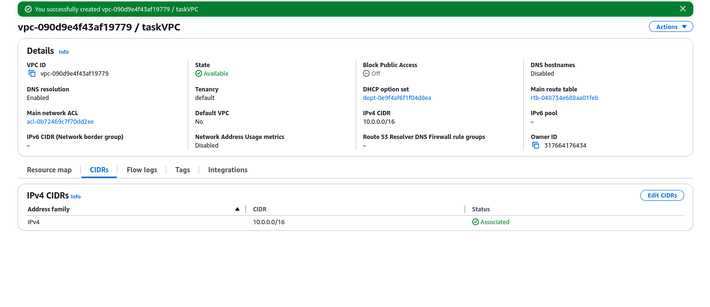

# AWS VPC: Public - Private Architecture Setup

**Author**: Ashish Jain  
**Reg No**: 11721210004  
**Workshop Task Documentation**

---

## Task 1: Manual Setup via AWS Console

---

### 1. Create a VPC
- **Action**: Created a custom VPC with CIDR `10.0.0.0/16`
- **Option Enabled**: DNS hostnames  
**📷 Screenshot**: 


---

### 2. Create Subnets
- **Public Subnet**: `10.0.1.0/24`  
- **Private Subnet**: `10.0.2.0/24`  
- **Region/Zone**: e.g., `us-east-1a`  
**📷 Screenshot**: *Insert screenshots of both subnets*

---

### 3. Create and Attach Internet Gateway (IGW)
- **Step 1**: Created IGW  
- **Step 2**: Attached IGW to the VPC  
**📷 Screenshot**:  
- Before attaching to a VPC  
- After attaching to a VPC

---

### 4. Allocate Elastic IP and Create NAT Gateway
- **Step 1**: Allocated Elastic IP  
- **Step 2**: Created NAT Gateway in Public Subnet using Elastic IP  
- **Step 3**: Waited until status became "Available"  
**📷 Screenshot**:  
- Creating an Internet Gateway  
- Creating a NAT gateway  
- Final NAT creation result

---

### 5. Create Route Tables

#### Public Route Table:
- **Step 1**: Created Public RT  
- **Step 2**: Route added: `0.0.0.0/0 -> IGW`  
- **Step 3**: Associated with Public Subnet  
**📷 Screenshot**: *Insert screenshot of public route table*

#### Private Route Table:
- **Step 1**: Created Private RT  
- **Step 2**: Route added: `0.0.0.0/0 -> NAT Gateway`  
- **Step 3**: Associated with Private Subnet  
**📷 Screenshot**: *Insert screenshot of private route table*

---

### 6. Configure Security Groups

#### Bastion SG
- **Inbound**: SSH (port 22) from My IP  
- **Outbound**: Allow All  
**📷 Screenshot**: *Insert screenshot of Bastion SG*

#### Backend EC2 SG
- **Inbound**: SSH (port 22) from `10.0.1.0/24`  
- **Outbound**: Allow All  
**📷 Screenshot**: *Insert screenshot of Backend SG*

---

### 7. Launch EC2 Instances

#### Bastion Host (Public Subnet)
- **AMI**: Amazon Linux 2  
- **Key Pair**: `bastion.pem`  
- **Subnet**: Public  
- **SG**: Bastion SG  
**📷 Screenshot**: *Insert screenshot of Bastion EC2 instance*

#### Backend EC2 (Private Subnet)
- **AMI**: Amazon Linux 2 / Ubuntu  
- **Key Pair**: `Backend.pem`  
- **Subnet**: Private  
- **SG**: Backend SG  
**📷 Screenshot**: *Insert screenshot of Backend EC2 instance*

---

### 8. Validation Screenshots

#### Bastion Host SSH Access
```bash
ssh -i bastion.pem ec2-user@<bastion-public-ip>
