# AWS VPC: Public - Private Architecture Setup

**Author**: Ashish Jain  
**Reg No**: 11721210004  
**Workshop Task Documentation**

---

## Task 1: Manual Setup via AWS Console

---

### 1. Create a VPC
- **Action**: Created a custom VPC with CIDR `10.0.0.0/16`
- **Option Enabled**: DNS hostnames  

---

### 2. Create Subnets
- **Public Subnet**: `10.0.1.0/24`  
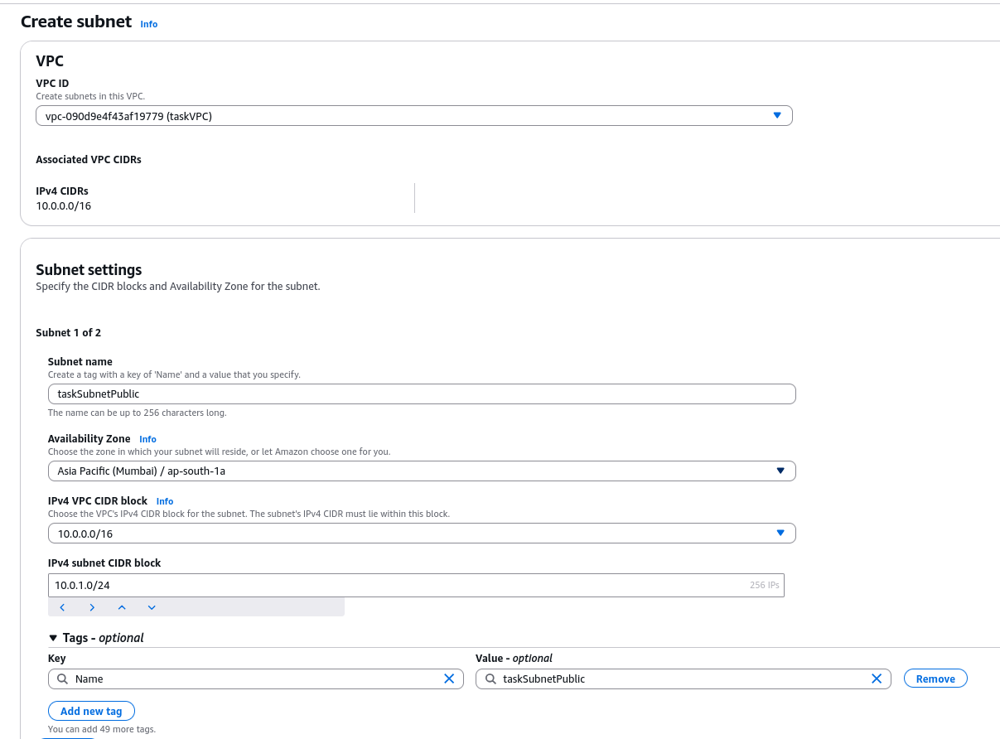
- **Private Subnet**: `10.0.2.0/24`  
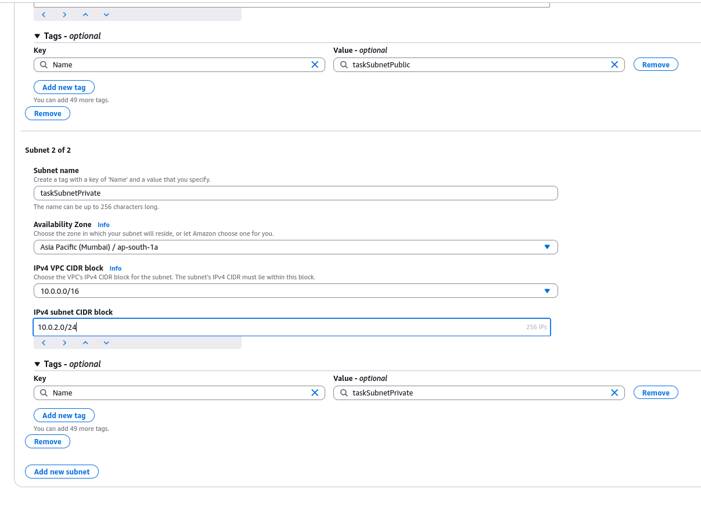
- **Region/Zone**: e.g., `ap-south-1`  

---

### 3. Create and Attach Internet Gateway (IGW)
- **Step 1**: Created IGW  
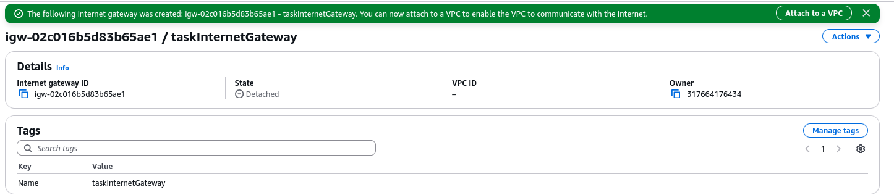
- **Step 2**: Attached IGW to the VPC  
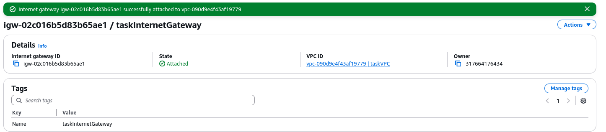

---

### 4. Create NAT Gateway
- **Step 1**: Allocated Elastic IP  
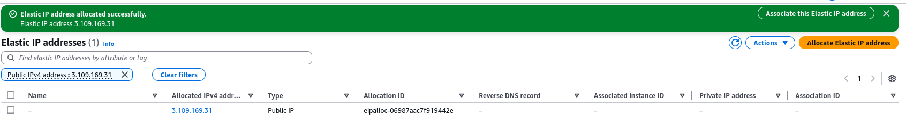
- **Step 2**: Created NAT Gateway in Public Subnet using Elastic IP  
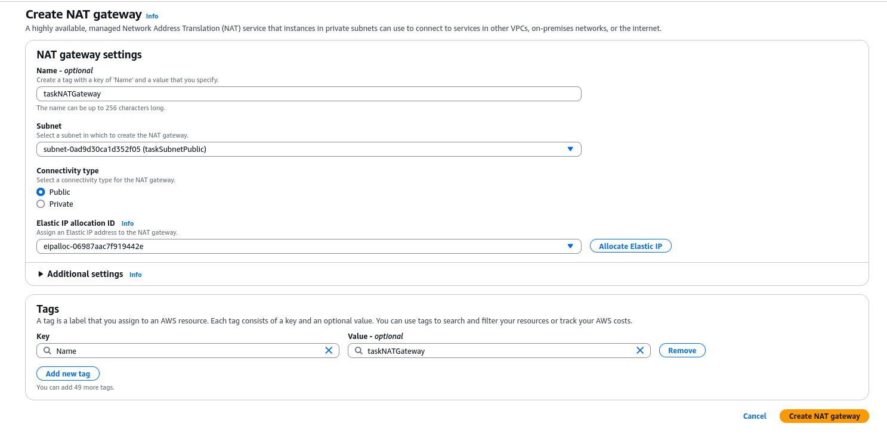
- **Step 3**: Waited until status became "Available"  
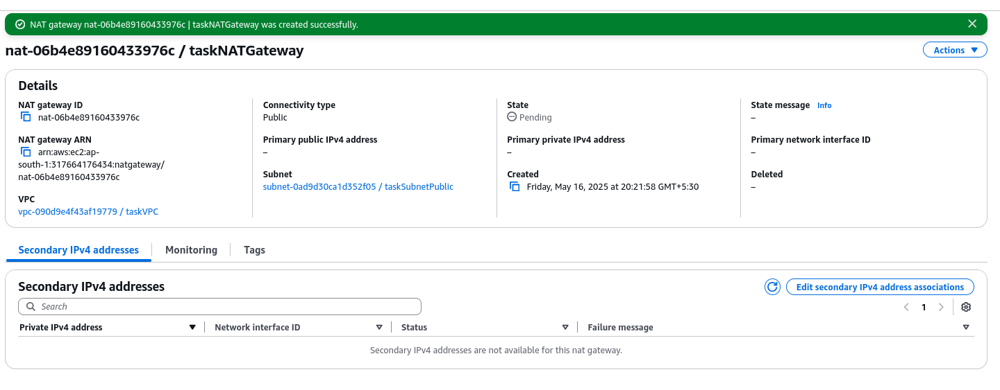

---

### 5. Create Route Tables

#### Public Route Table:
- **Step 1**: Created Public RT  
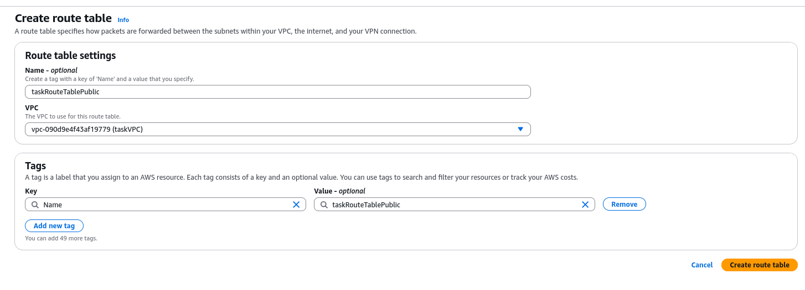
- **Step 2**: Route added: `0.0.0.0/0 -> IGW`  
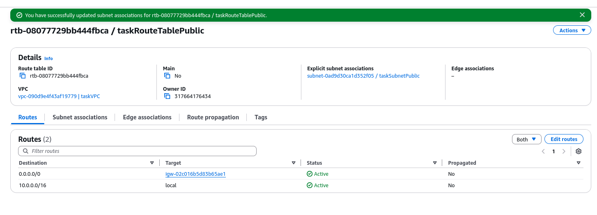
- **Step 3**: Associated with Public Subnet  
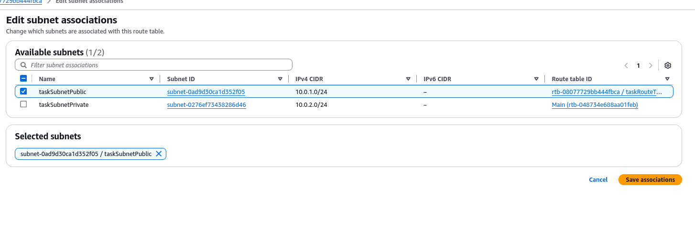

#### Private Route Table:
- **Step 1**: Created Private RT  
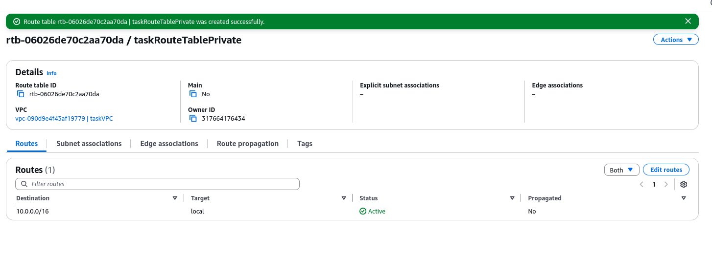
- **Step 2**: Route added: `0.0.0.0/0 -> NAT Gateway`  
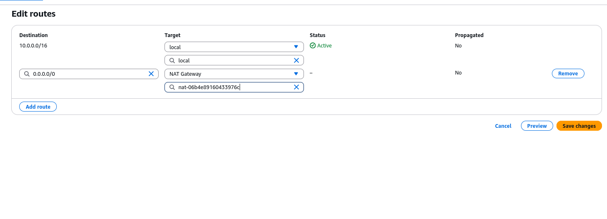
- **Step 3**: Associated with Private Subnet  
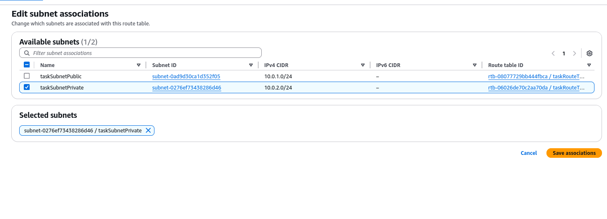

---

### 6. Configure Security Groups

#### Bastion SG
- **Inbound**: SSH (port 22) from My IP  
- **Outbound**: Allow All  
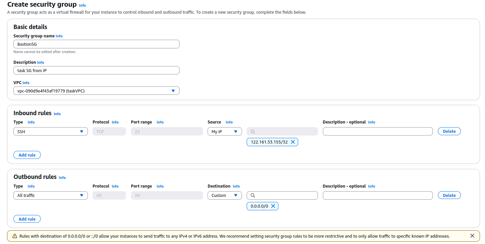

#### Backend EC2 SG
- **Inbound**: SSH (port 22) from `10.0.1.0/24`  
- **Outbound**: Allow All  
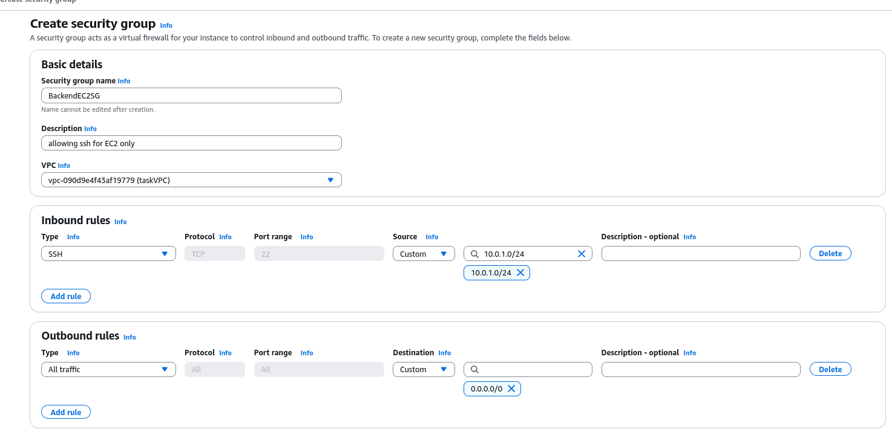

---

### 7. Launch EC2 Instances

#### Bastion Host (Public Subnet)
- **AMI**: Ubunti
- **Key Pair**: `bastion.pem`  
- **Subnet**: Public  
- **SG**: BastionSG  
**📷 Screenshots**: 
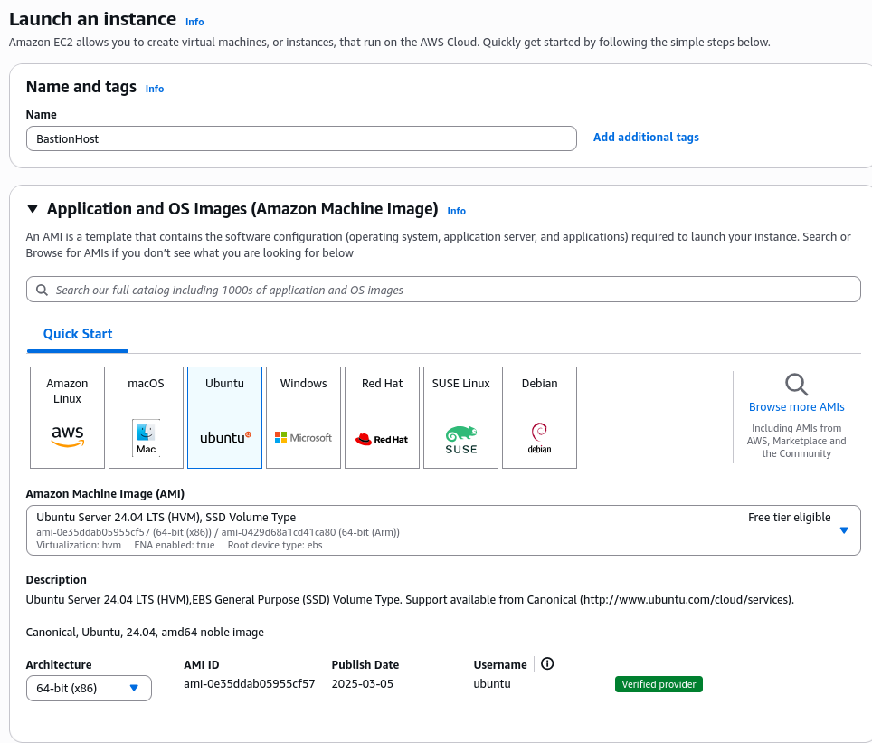
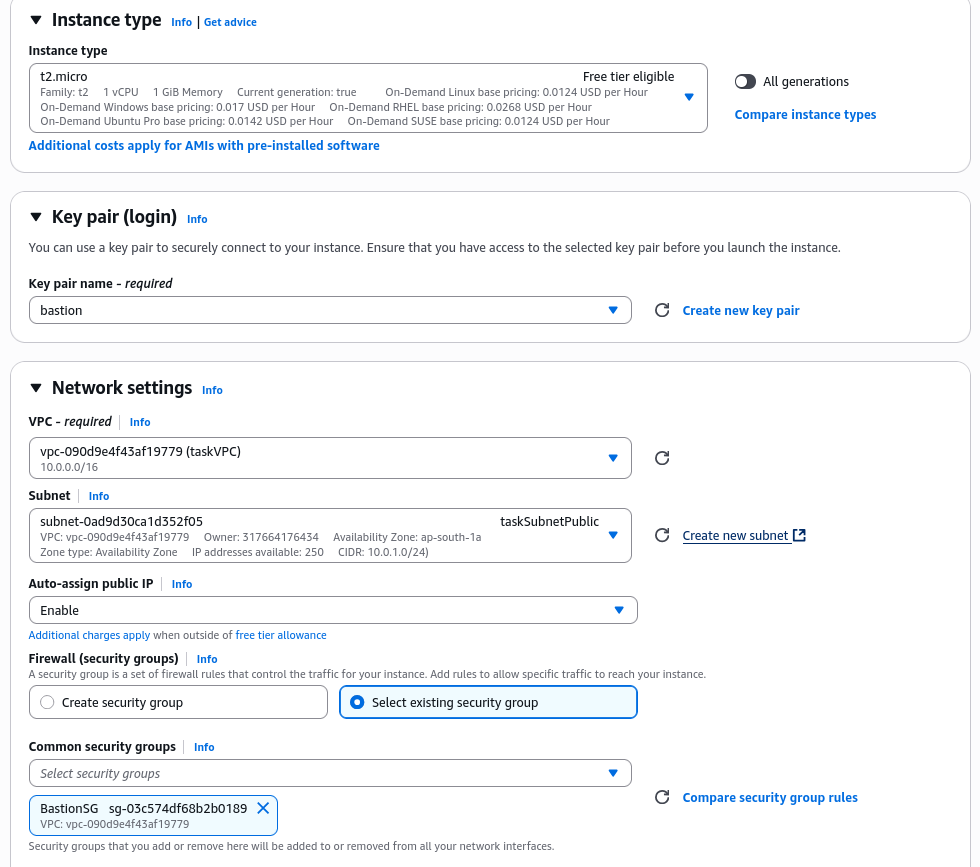

#### Backend EC2 (Private Subnet)
- **AMI**: Amazon Linux 2 / Ubuntu  
- **Key Pair**: `Backend.pem`  
- **Subnet**: Private  
- **SG**: BackendSG  
**📷 Screenshot**: 
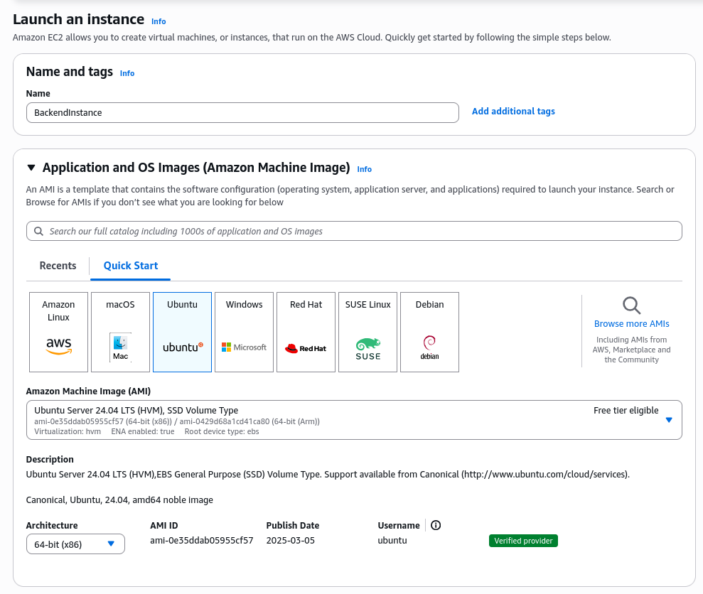
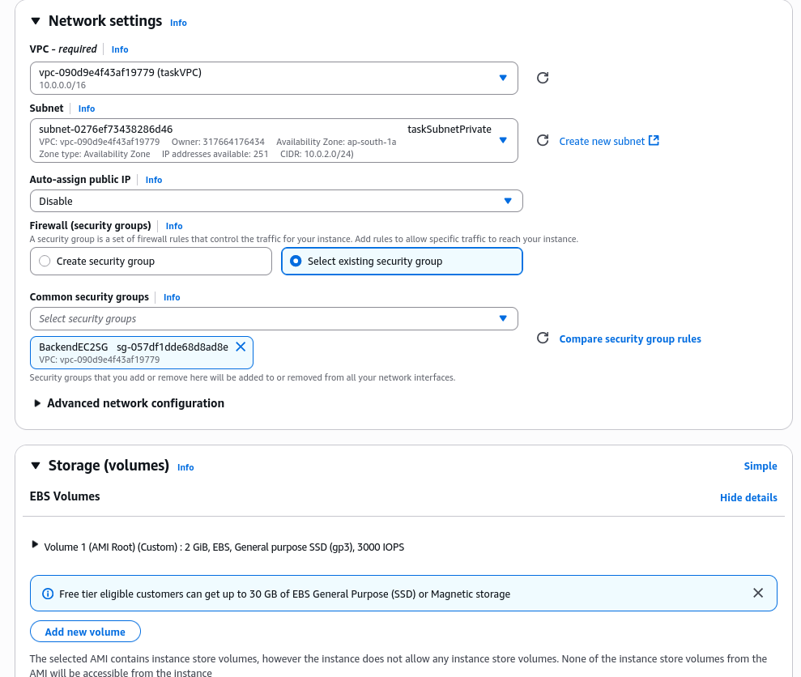

---

### 8. Validation Screenshots
- **Validate Bastion Access**
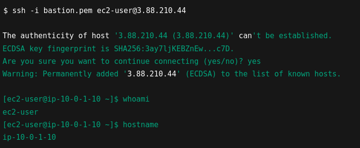
- **Validate Backend Access**

- **Validate Internet Access**
- *Ping google.com*
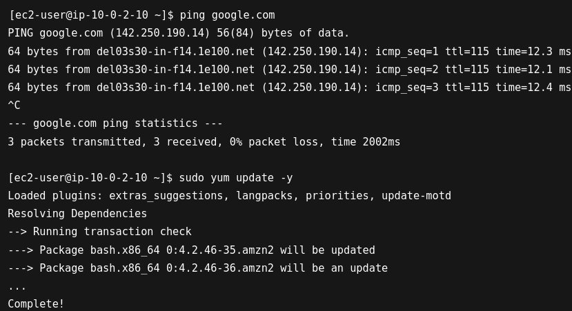
- *Updating Ubuntu using APT install*
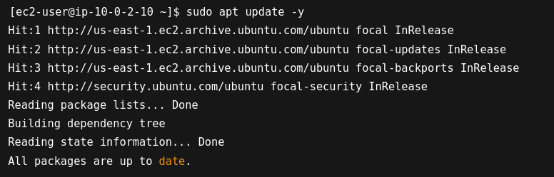